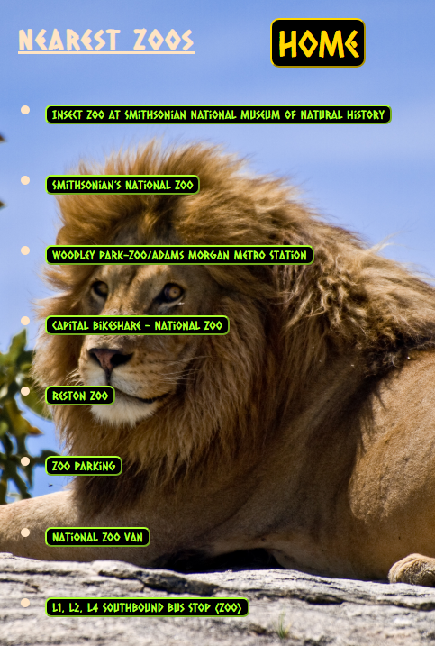

# Zoo Finder

An app designed to warm the hearts of animal lovers exploring a new town by helping them find zoos or zoo-related activities in the city.

# <a href="https://ahmedthewavemaker.github.io/zoo-finder/">Live Demo</a>

# Screenshots:

Mobile-friendly version:

# Summary

Users can enter the city of choice, hit "Adventure time!" and have a list of places and options to look at. Once they select an option, a display of the name of the zoo/place, the foursquare ratings and reviews, and finally the zoo/place's external link will be displayed to them so they can book or plan their next destination or simply explore virtually to get a feel of the place. If the user would like to reset his/her search, they can simply hit the "Home" button, which will take them to the initial screen and they can put a new city of choice.

# Tech Used:

- Jquery
- HTML
- CSS
- Javascript
